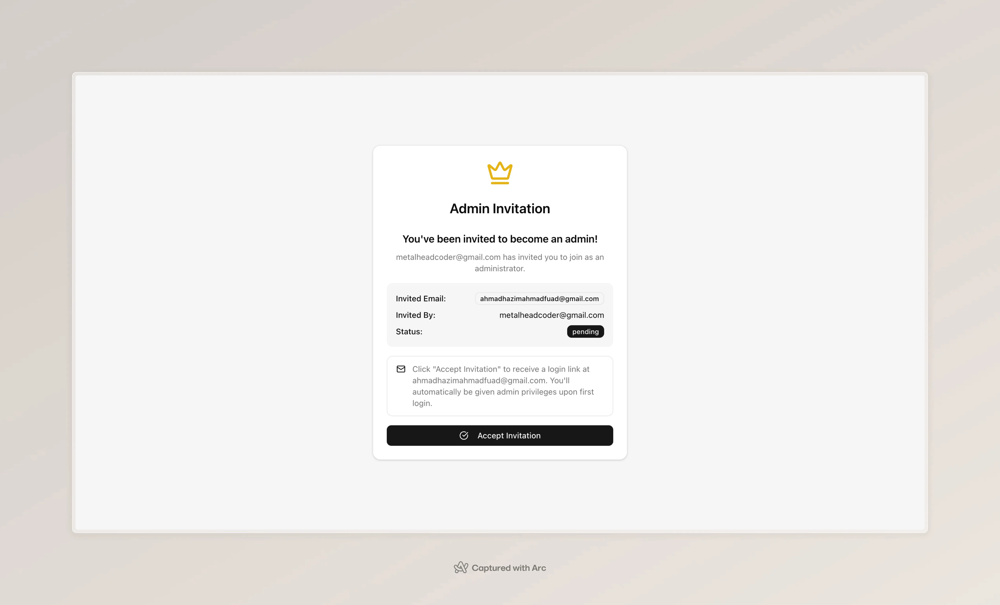
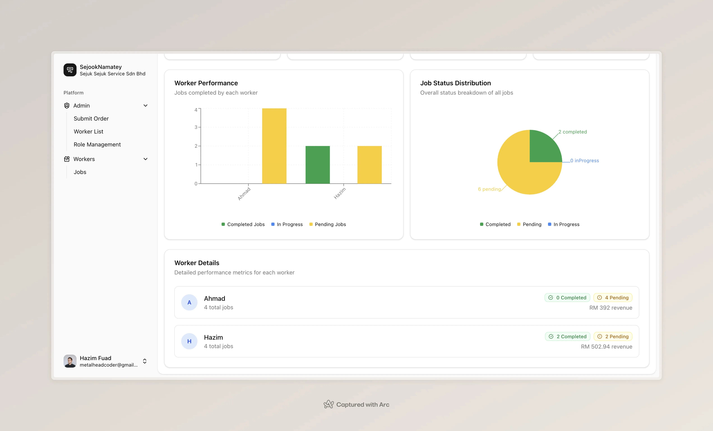
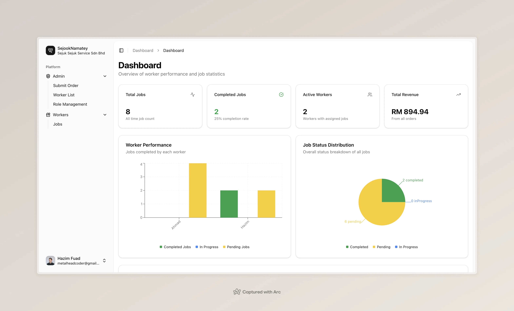
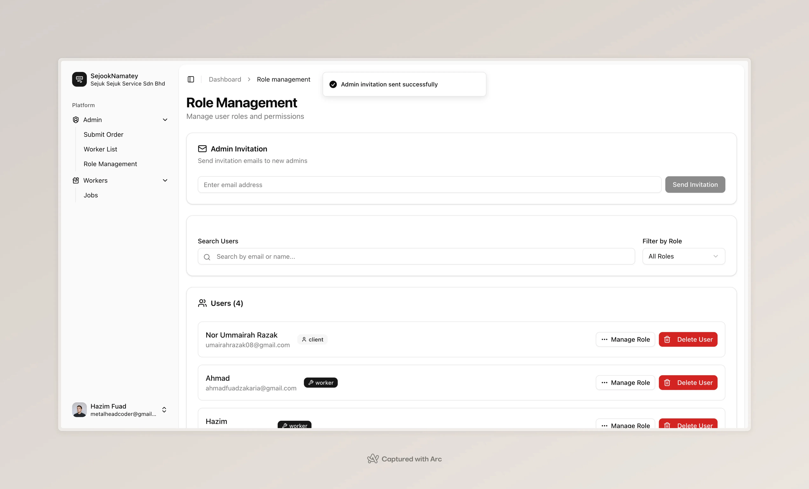
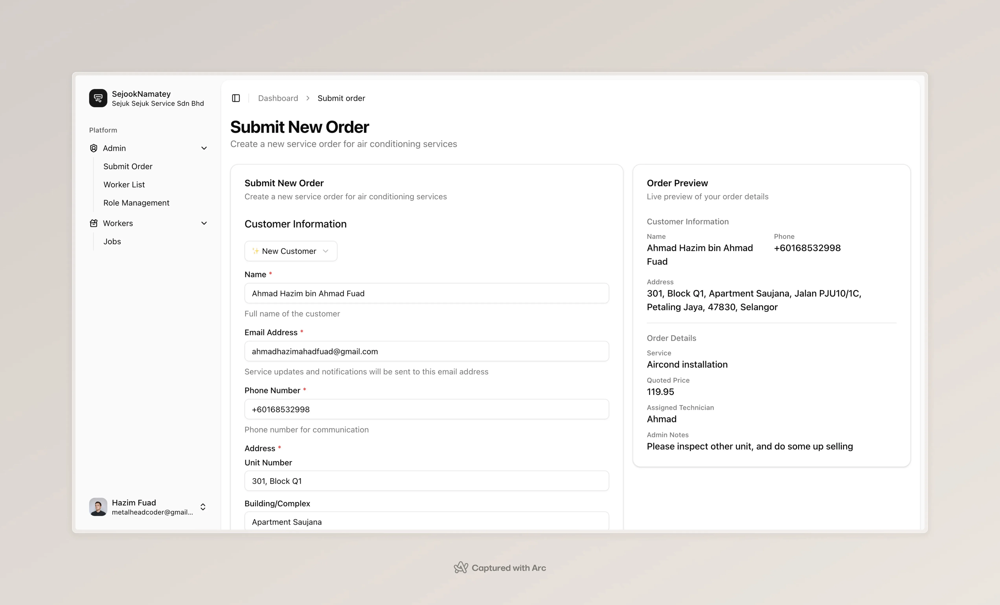
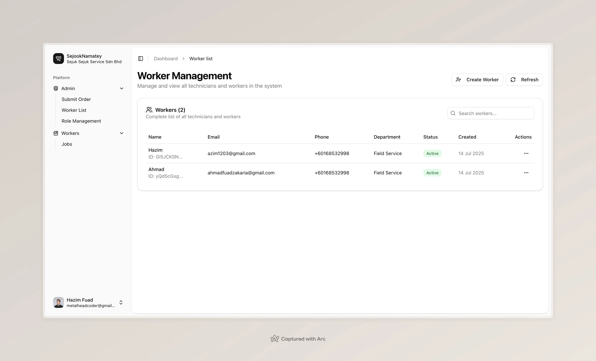
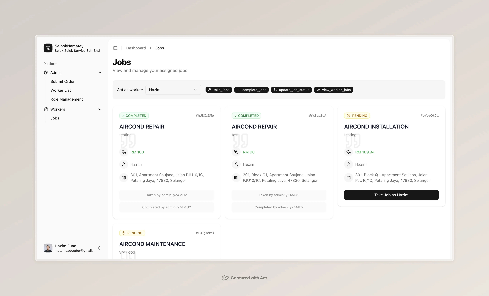

# 🚀 Utopia Assessment - Service Management System

<div align="center">


*A modern, full-stack service management system built with Next.js and TypeScript*

</div>

---

## 📋 Table of Contents

- [🎯 Project Overview](#-project-overview)
- [🏢 Company Story](#-company-story)
- [✨ Features](#-features)
- [🛠️ Tech Stack](#️-tech-stack)
- [🚀 Getting Started](#-getting-started)
- [📱 Screenshots](#-screenshots)
- [🔧 Development](#-development)
- [📄 License](#-license)

---

## 🎯 Project Overview

This project is a showcase of [**@metalheadcode's**](https://github.com/metalheadcode) full-stack development skills, demonstrating expertise in:

- 🎨 **Modern React/Next.js** application architecture
- 🔷 **TypeScript** and strong typing practices
- 🧹 **Clean, maintainable** code practices
- 📱 **Responsive UI/UX** design
- 🔄 **State management** and data flow
- 🔌 **API integration** and handling

### 🎯 Project Goals

The project aims to demonstrate the ability to:
- 🏗️ Build a full-featured service management system
- ⚙️ Implement complex business logic and workflows
- 🎨 Create an intuitive user interface
- 📊 Handle real-world data requirements
- ✅ Follow best practices in modern web development

---

## 🏢 Company Story

<div align="center">

### 🌟 Welcome to **Sejuk Sejuk Service Sdn Bhd!** 🌟

*"A fictional company that's super cool - pun intended!"* ❄️

</div>

We're your go-to experts for all things **air conditioning** - from installation to servicing and repairs, serving both homes and businesses across Malaysia through our **5 nationwide branches**.

### 👥 Our Team
- **20+ skilled technician crews** who are always ready to keep you comfortable!
- **Admin team** manages operations from their desktops
- **Tech-savvy technicians** stay mobile with their devices

### 🎯 Our Mission
To transform our entire workflow into a **seamless digital experience** - from the moment you place an order, through assignment and completion, all the way to final review by our managers and accounts team! ✨

---

## ✨ Features

### 🔔 Real-time Notifications
- **WhatsApp integration** for job completion notifications
- **EmailJS** for automated email communications
- **Real-time status updates** for customers and technicians

### 📊 Dashboard & Management
- **Order tracking** and status management
- **Technician assignment** and scheduling
- **Customer information** management
- **Service history** and analytics

### 🎨 User Experience
- **Responsive design** for all devices
- **Intuitive navigation** and user interface
- **Form validation** with Zod schema
- **Modern UI components** with shadcn/ui

---

## 🛠️ Tech Stack

### 🎨 Frontend
| Technology | Purpose | Version |
|------------|---------|---------|
|  | React Framework | 14 |
|  | Type Safety | 5.0 |
|  | Styling | 3.0 |
|  | Form Management | 7.0 |
|  | Schema Validation | 3.0 |
|  | UI Components | Latest |

### 🔥 Backend
| Technology | Purpose | Version |
|------------|---------|---------|
|  | Backend Services | 10.0 |

---

## 🚀 Getting Started

### Prerequisites
- Node.js 18+ 
- npm or yarn
- Firebase account

### Installation

```bash
# Clone the repository
git clone https://github.com/metalheadcode/utopia-assessment.git

# Navigate to project directory
cd utopia-assessment

# Install dependencies
npm install
# or
yarn install

# Set up environment variables
cp .env.example .env.local

# Run the development server
npm run dev
# or
yarn dev
```

Open [http://localhost:3000](http://localhost:3000) with your browser to see the result.

---

## 📱 Screenshots

#### *Admin Invitation* 👑
Admin invitation allows administrators to send secure login links to new users. The system ensures that only authorized administrators can create new accounts, maintaining security and access control. Features include:

- 📧 Email-based authentication
- 🔒 Secure one-time login links
- ⚡ Quick account setup process
- 🛡️ Role-based access control
- 📱 Responsive design for all devices



#### *Dashboard* 🖥️
The dashboard provides a comprehensive overview of service operations, displaying key statistics, recent activities, and quick access to essential management features. It empowers admins and managers to monitor business performance, track orders, and make informed decisions at a glance.

- 📊 Real-time statistics and analytics
- 🗂️ Quick access to orders, workers, and customers
- 🖥️ Centralized management interface
- 📱 Fully responsive for desktop and mobile




#### *Role Management* 
Role management allows administrators to assign, update, and review user roles and permissions within the system. This ensures that each team member has the appropriate level of access, supporting secure and efficient operations.

- 🛡️ Fine-grained access control
- 👥 Assign roles to users (admin, worker, customer, etc.)
- 🔄 Update permissions as business needs evolve
- 📱 Responsive and easy to use



#### *Create New Order For Worker*
The order creation form streamlines the process of assigning new jobs to workers. Admins can quickly input order details, select workers, and set schedules, ensuring efficient job allocation and clear communication.

- 📝 Simple, guided order submission
- 👷 Assign jobs to available workers
- 📅 Schedule service dates and times
- ✅ Form validation for data accuracy



#### *Worker Management*
Worker management provides tools for admins to view, add, and update worker profiles. It helps keep track of technician availability, skills, and assignments, supporting optimal resource allocation and team organization.

- 👷 View and manage worker profiles
- 🗓️ Track assignments and availability
- ✏️ Edit worker details as needed
- 📱 Mobile-friendly interface



#### *Job List For Worker*
The job list displays all assigned jobs for each worker, including job details, status, and delegation options. Workers can easily see their tasks, mark jobs as complete, and handle delegated responsibilities, improving workflow and accountability.

- 📋 List of assigned jobs with status
- 🔄 Delegation management for flexible teamwork
- ✅ Mark jobs as complete
- 📱 Optimized for use on mobile devices




---

## 🔧 Development

### Project Structure
```
utopia-assessment/
├── app/                 # Next.js app directory
├── components/          # Reusable UI components
├── lib/                 # Utility functions
├── types/               # TypeScript type definitions
├── data/                # Static data files
└── public/              # Static assets
```

### Available Scripts
- `npm run dev` - Start development server
- `npm run build` - Build for production
- `npm run start` - Start production server
- `npm run lint` - Run ESLint

---

## ⚠️ Important Notice

<div align="center">

### 🔒 Intellectual Property Rights

</div>

This project and all associated code belongs to [**@metalheadcode**](https://github.com/metalheadcode). While made public for portfolio and assessment purposes, this work was created in good faith as part of an evaluation process. The code remains the intellectual property of [**@metalheadcode**](https://github.com/metalheadcode) and may not be used, copied, or repurposed without explicit permission.

### 🚫 Disclaimer
This assessment was shared publicly to demonstrate skills and capabilities. It was **not intended as free work** or for commercial use. Any unauthorized use or reproduction of this code without consent is **strictly prohibited**.

---

## 📄 License

This project is proprietary and confidential. All rights reserved by [**@metalheadcode**](https://github.com/metalheadcode).

---

<div align="center">

### 🌟 Made with ❤️ by [@metalheadcode](https://github.com/metalheadcode)

*Building the future, one line of code at a time* 🚀

</div>